<div align="center">

# HelpDesk

### Role-Based IT Support Ticket Management System

A full-stack help desk application for managing internal support requests through dedicated **Admin**, **Agent**, and **Employee** workflows.

[](https://nextjs.org/)
[](https://nestjs.com/)
[](https://www.typescriptlang.org/)
[](https://www.postgresql.org/)
[](https://typeorm.io/)
[](https://tailwindcss.com/)

[Repository](https://github.com/ifti-77/HelpDesk) · [Report an Issue](https://github.com/ifti-77/HelpDesk/issues)

</div>

---

## Overview

**HelpDesk** is a portfolio-focused full-stack application that models a practical internal IT support workflow.

Employees create support tickets, administrators manage users and assign tickets, and support agents investigate, discuss, resolve, or reject assigned requests. Authentication is implemented with JWTs stored in HTTP-only cookies, while role-specific guards protect backend routes and role-specific interfaces control what each user can access.

The project demonstrates:

- Full-stack TypeScript development
- REST API design with NestJS
- Role-based access control
- Relational data modelling with PostgreSQL and TypeORM
- Secure cookie-based authentication
- Stateful dashboard interfaces with Next.js
- Real-world ticket lifecycle and ownership rules

---

## Application Preview

### Admin Dashboard

The admin dashboard provides system-level totals and quick access to user and ticket management workflows.

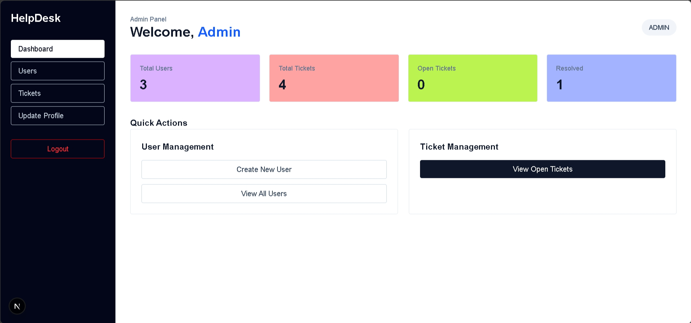

<details>
<summary><strong>View additional Admin screenshots</strong></summary>

### User Management

Administrators can view users, search by email, reset passwords, change roles, and activate or deactivate accounts.

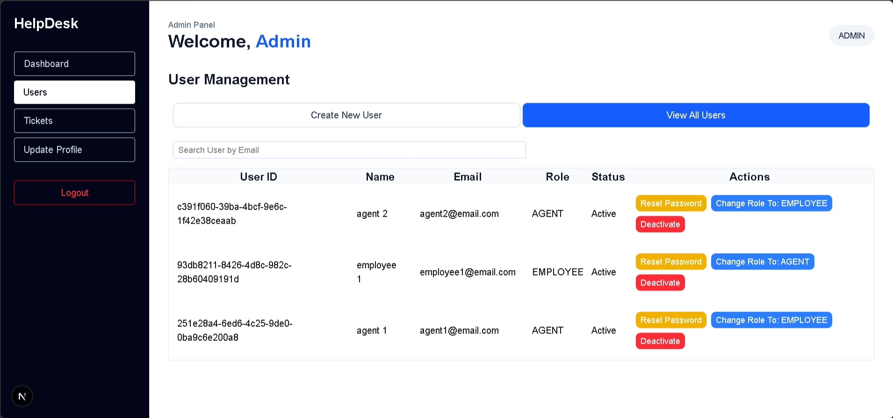

### Ticket Management

Administrators can switch between newly opened, rejected, and in-progress tickets, search by ticket ID, and open the ticket detail modal.

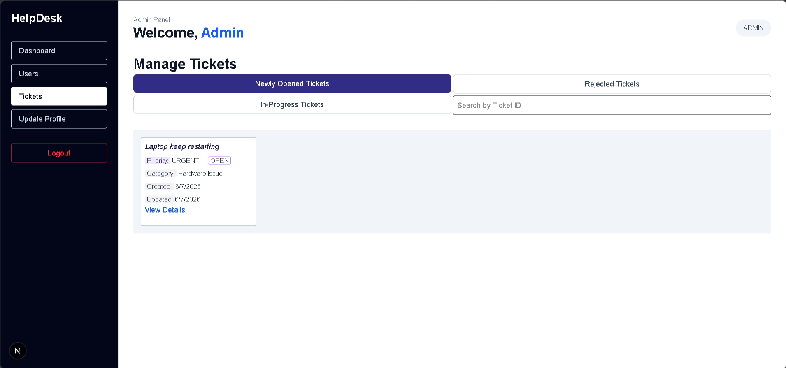

### Ticket Assignment and Details

The ticket detail modal displays ticket metadata, ownership, assignment, description, discussion, and available administrative actions.

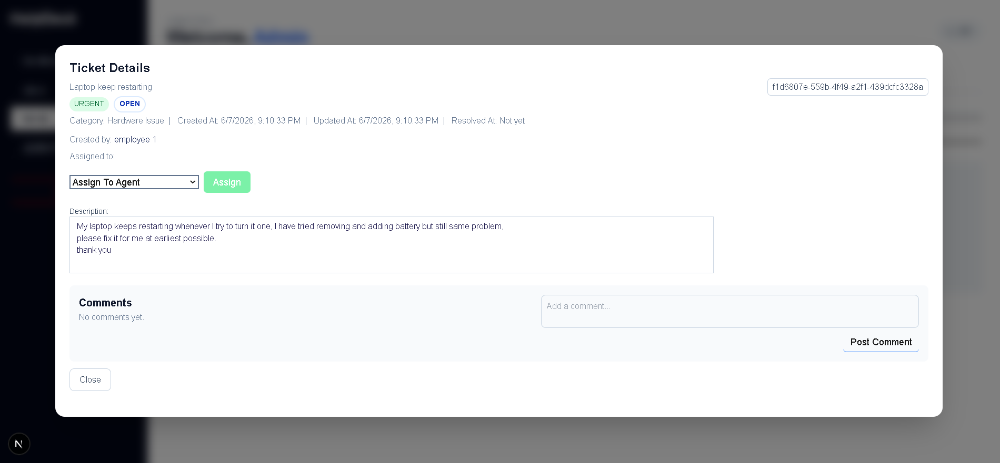

### Profile Management

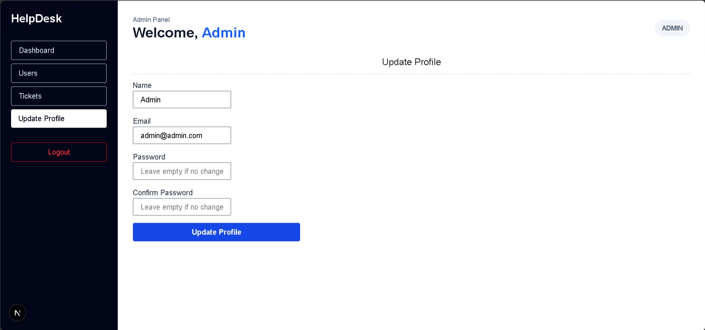

</details>

### Agent Workflow

Agents can review assigned, rejected, and resolved tickets, search within their workload, communicate through comments, and resolve or reject tickets.

<table>
  <tr>
    <td width="50%">
      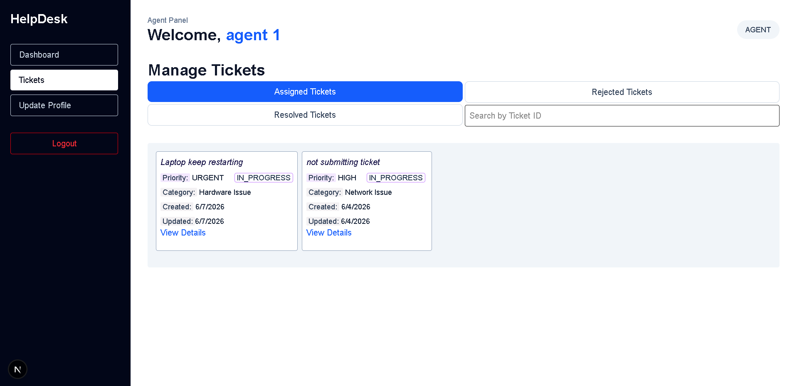
    </td>
    <td width="50%">
      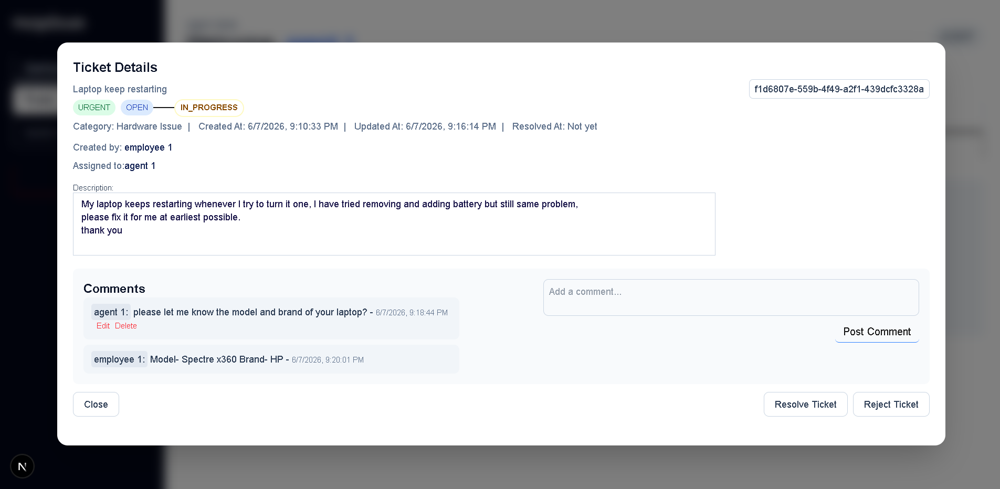
    </td>
  </tr>
  <tr>
    <td align="center"><strong>Assigned Ticket Workspace</strong></td>
    <td align="center"><strong>Ticket Resolution and Discussion</strong></td>
  </tr>
</table>

### Employee Workflow

Employees can monitor their ticket statistics, create support requests, review ticket details, participate in discussions, and update eligible tickets.

#### Employee Dashboard

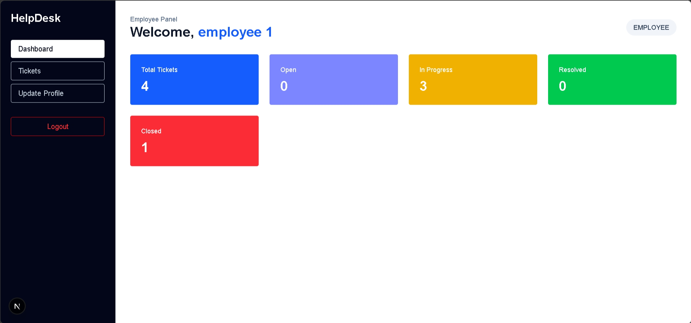

<details>
<summary><strong>View additional Employee screenshots</strong></summary>

### Create Ticket

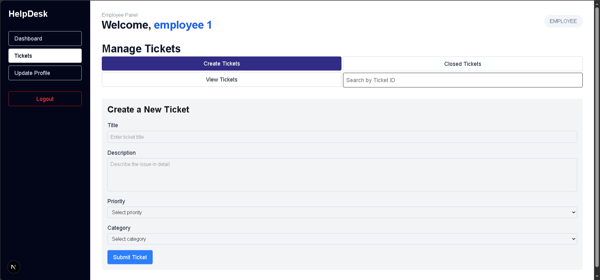

### View Ticket

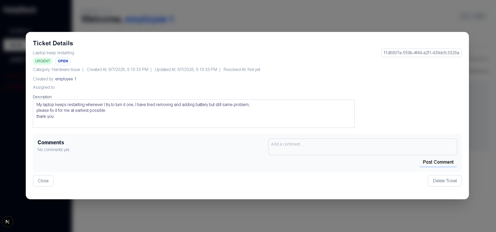

### Update Ticket

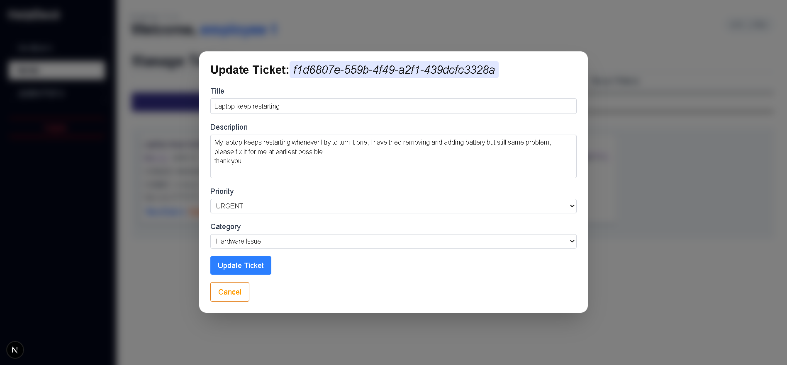

</details>

---

## Core Features

### Authentication and Authorization

- Email and password login
- Password hashing with bcrypt
- JWT-based authentication
- JWT stored in an HTTP-only cookie
- Cookie-aware CORS configuration
- Separate Admin, Agent, and Employee guards
- Automatic redirection between login and dashboard pages
- Protected role-based backend endpoints
- Account activation checks during login
- Secure logout by clearing the authentication cookie

### Admin Features

- View dashboard statistics
- Create Employee and Agent accounts
- View and search users
- Reset user passwords
- Change a user's role
- Activate or deactivate accounts
- View newly opened tickets
- View rejected and in-progress tickets
- Search tickets by ID
- Assign or reassign tickets to active agents
- View full ticket details and discussion
- Add comments to tickets
- Update personal profile information

### Agent Features

- View assigned tickets
- View rejected and resolved tickets
- Search assigned tickets by ID
- Inspect ticket metadata and employee details
- Communicate with employees through comments
- Edit or delete only personally authored comments
- Resolve tickets
- Reject tickets for administrative reassignment
- Update personal profile information

### Employee Features

- View personal ticket statistics
- Create support tickets
- Select category and priority
- View owned tickets
- Search tickets by ID
- Update eligible ticket details
- Delete eligible tickets
- View closed tickets
- Add comments to ticket discussions
- Edit or delete only personally authored comments
- Update personal profile information

### Ticket Management

- UUID-based ticket identifiers
- Ticket categories:
  - Hardware Issue
  - Software Issue
  - Network Issue
  - Account/Login Issue
  - Asset Request
  - General Support
- Priorities:
  - Low
  - Medium
  - High
  - Urgent
- Lifecycle statuses:
  - Open
  - In Progress
  - Resolved
  - Closed
  - Rejected
- Created, updated, resolved, and closed timestamps
- Employee ownership and agent assignment relationships
- Role-aware ticket filtering
- Ticket statistics by status
- Debounced ticket search

### Commenting and Ownership

- Ticket-based discussion between employees, agents, and administrators
- Author details and timestamps on each comment
- Inline comment editing
- Comment deletion
- Edit and delete controls visible only to the comment author
- Backend ownership verification before update or deletion

---

## Role Capability Matrix

| Capability | Admin | Agent | Employee |
|---|:---:|:---:|:---:|
| View personal dashboard | Yes | Yes | Yes |
| Update own profile | Yes | Yes | Yes |
| Manage users | Yes | No | No |
| Create Employee/Agent accounts | Yes | No | No |
| Activate/deactivate accounts | Yes | No | No |
| Create tickets | No | No | Yes |
| View all operational tickets | Yes | Assigned workload | Own tickets |
| Assign tickets | Yes | No | No |
| Resolve or reject tickets | Administrative workflow | Yes | No |
| Close eligible tickets | Administrative workflow | No | Yes |
| Add ticket comments | Yes | Yes | Yes |
| Edit/delete own comments | Yes | Yes | Yes |
| Search tickets | Yes | Yes | Yes |

---

## Ticket Workflow

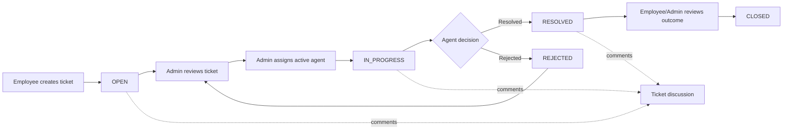

---

## Architecture

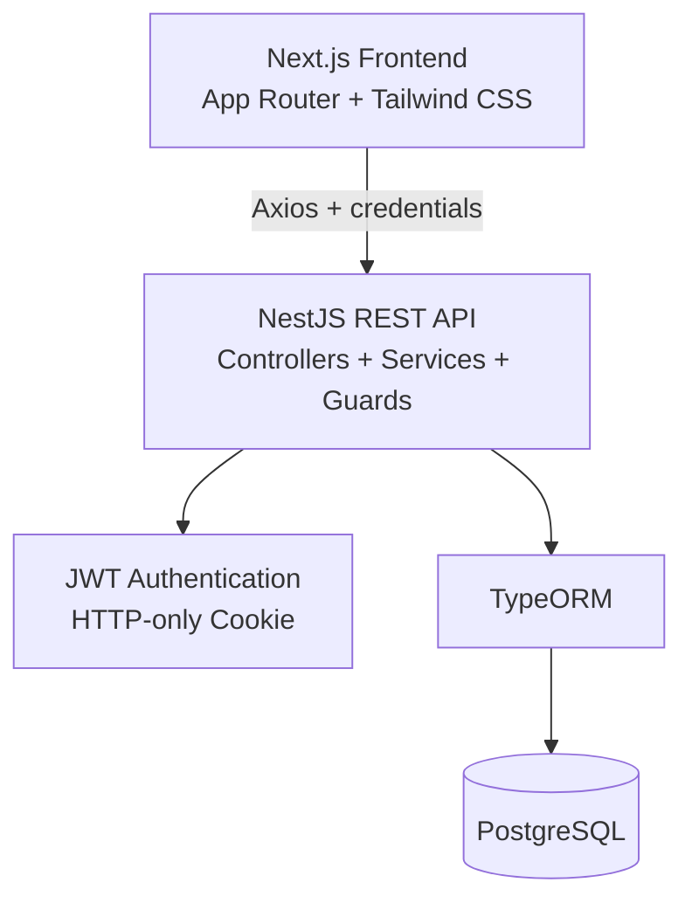

### Backend Organization

The API is separated by responsibility and role:

```text
backend/src/
├── auth/          # Login, logout, current-user authentication
├── admin/         # User administration and ticket assignment
├── agent/         # Assigned ticket processing
├── employee/      # Employee profile and owned-ticket operations
├── entities/      # User, Ticket, and TicketComment entities
├── app.module.ts
└── main.ts
```

### Main Data Model

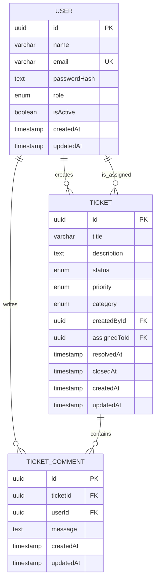

---

## Technology Stack

| Layer | Technology | Responsibility |
|---|---|---|
| Frontend | Next.js, React, TypeScript | Role-specific dashboard UI and routing |
| Styling | Tailwind CSS | Responsive layout and component styling |
| HTTP Client | Axios | Cookie-aware API communication |
| Validation | Zod | Client-side form validation |
| Backend | NestJS, Node.js, TypeScript | REST API, services, guards, validation |
| Authentication | JWT, HTTP-only cookies, bcrypt | Sessions, authorization, and password security |
| ORM | TypeORM | Entity mapping and database access |
| Database | PostgreSQL | Persistent relational data |
| API Validation | class-validator, class-transformer | DTO validation and payload sanitization |

---

## Project Structure

```text
HelpDesk/
├── backend/
│   ├── src/
│   ├── package.json
│   └── ...
├── frontend/
│   ├── app/ or src/app/
│   ├── components/
│   ├── CustomTypes/
│   ├── package.json
│   └── ...
├── screenshots/
│   ├── admin-dashboard.png
│   ├── admin-ticket-list.png
│   ├── admin-ticket-view.PNG
│   ├── admin-update-profile.png
│   ├── admin-user-list.png
│   ├── agent-ticket-list.PNG
│   ├── agent-ticket-view.PNG
│   ├── employee-dashboard.png
│   ├── employee-create-ticket.png
│   ├── employee-ticket-view.PNG
│   └── employee-update-ticket.PNG
└── README.md
```

---

## Getting Started

### Prerequisites

Install the following before running the project:

- Node.js 20 or later
- npm
- PostgreSQL
- Git

### 1. Clone the Repository

```bash
git clone https://github.com/ifti-77/HelpDesk.git
cd HelpDesk
```

### 2. Create the PostgreSQL Database

Using `psql`:

```sql
CREATE DATABASE help_desk;
```

You may also create the database through pgAdmin.

### 3. Configure the Backend

Create:

```text
backend/.env
```

Example:

```env
PORT=5000
SERVER_ADDRESS=http://localhost
FRONTEND_PORT=3000

JWT_SECRET=replace_with_a_long_random_secret
NODE_ENV=development

DB_HOST=localhost
DB_PORT=5432
DB_USERNAME=postgres
DB_PASSWORD=your_postgresql_password
DB_NAME=help_desk
```

The backend currently requires its TypeORM connection values to match your PostgreSQL installation. If your `app.module.ts` still contains inline database values, update them directly or refactor the configuration to read the `DB_*` variables above.

For development, TypeORM synchronization can create tables automatically. For production, disable `synchronize` and use migrations.

### 4. Install and Run the Backend

```bash
cd backend
npm install
npm run start:dev
```

The backend should run at:

```text
http://localhost:5000
```

### 5. Configure the Frontend

Create:

```text
frontend/.env.local
```

Add:

```env
NEXT_PUBLIC_API_URL=http://localhost:5000
```

### 6. Install and Run the Frontend

Open a second terminal:

```bash
cd frontend
npm install
npm run dev
```

The frontend should run at:

```text
http://localhost:3000
```

### 7. Create the Initial Admin Account

The system requires an Admin account before other users can be created.

Generate a bcrypt password hash from the backend directory:

```bash
node -e "const bcrypt = require('bcrypt'); bcrypt.hash('ChangeMe123!', 10).then(console.log)"
```

Enable UUID generation in PostgreSQL if required:

```sql
CREATE EXTENSION IF NOT EXISTS "pgcrypto";
```

Insert the admin using the generated hash:

```sql
INSERT INTO users (
  id,
  name,
  email,
  "passwordHash",
  role,
  "isActive",
  "createdAt",
  "updatedAt"
)
VALUES (
  gen_random_uuid(),
  'Admin',
  'admin@example.com',
  '<PASTE_BCRYPT_HASH_HERE>',
  'ADMIN',
  true,
  CURRENT_TIMESTAMP,
  CURRENT_TIMESTAMP
);
```

Sign in with the email and plain password used to generate the hash, then create Agent and Employee accounts from the Admin dashboard.

> Never commit real credentials, JWT secrets, or `.env` files.

---

## Available Scripts

### Backend

```bash
npm run start          # Start the NestJS application
npm run start:dev      # Start in watch mode
npm run build          # Build the backend
npm run start:prod     # Run the production build
npm run lint           # Run ESLint with fixes
npm run format         # Format source files
npm run test           # Run unit tests
npm run test:e2e       # Run end-to-end tests
npm run test:cov       # Generate test coverage
```

### Frontend

Common Next.js scripts:

```bash
npm run dev            # Start the development server
npm run build          # Create a production build
npm run start          # Run the production build
npm run lint           # Run linting
```

---

## API Organization

The backend uses role-based route groups:

| Route Group | Purpose |
|---|---|
| `/auth/*` | Login, logout, and current-user authentication |
| `/admin/*` | User management, system ticket management, assignment |
| `/agent/*` | Assigned-ticket processing and agent actions |
| `/employee/*` | Employee profile and owned-ticket management |

Examples of the resource structure:

```text
POST   /auth/login
GET    /admin/profile
GET    /admin/users
GET    /admin/tickets
GET    /agent/tickets
PATCH  /agent/tickets/:ticketId/status
POST   /employee/tickets
GET    /employee/tickets
PATCH  /employee/tickets/:ticketId
POST   /{role}/tickets/:ticketId/comments
PATCH  /{role}/tickets/:ticketId/comments/:commentId
DELETE /{role}/tickets/:ticketId/comments/:commentId
```

Exact routes may vary as the project evolves; refer to the role controllers for the current API contract.

---

## Security Notes

- Passwords are hashed and never stored as plain text.
- JWTs are stored in HTTP-only cookies.
- Backend guards verify authentication and role authorization.
- Client requests include credentials so the browser sends the authentication cookie.
- Comment update/delete operations verify server-side ownership.
- User accounts can be deactivated without removing historical ticket data.
- DTO validation rejects malformed input.
- CORS is configured for the frontend origin.

Before production deployment:

- Use a long, randomly generated JWT secret.
- Set secure cookies over HTTPS.
- Replace `synchronize: true` with migrations.
- Keep all database credentials in environment variables.
- Add rate limiting and login attempt protection.
- Add CSRF protection if the deployment architecture requires it.
- Add automated unit and end-to-end coverage for critical authorization rules.

---

## Engineering Highlights

This project is particularly relevant to junior full-stack and backend roles because it demonstrates:

- Clear separation between controllers, services, entities, DTOs, and guards
- Resource ownership checks beyond simple UI hiding
- Role-based API design
- One-to-many and many-to-one relational modelling
- Immutable React state updates for nested ticket/comment data
- Server-protected HTTP-only cookie authentication
- Realistic administrative and support-agent workflows
- Form validation on both client and server
- Search, filtering, dashboard metrics, modal workflows, and conditional rendering

---

## Planned Improvements

- Replace development synchronization with TypeORM migrations
- Add Swagger/OpenAPI documentation
- Add pagination and sorting for users and tickets
- Add file attachments to tickets and comments
- Add email or in-app notifications
- Add ticket activity/audit history
- Add SLA deadlines and escalation rules
- Add automated tests for guards and ownership policies
- Add Docker Compose for frontend, backend, and PostgreSQL
- Add CI checks for linting, tests, and builds
- Add a production deployment and live demo

---

## Author

Developed by **Ifti**

- GitHub: [@ifti-77](https://github.com/ifti-77)
- Repository: [github.com/ifti-77/HelpDesk](https://github.com/ifti-77/HelpDesk)

---

## License

This repository currently does not include an explicit open-source license. Add a `LICENSE` file before redistributing or accepting external contributions.
